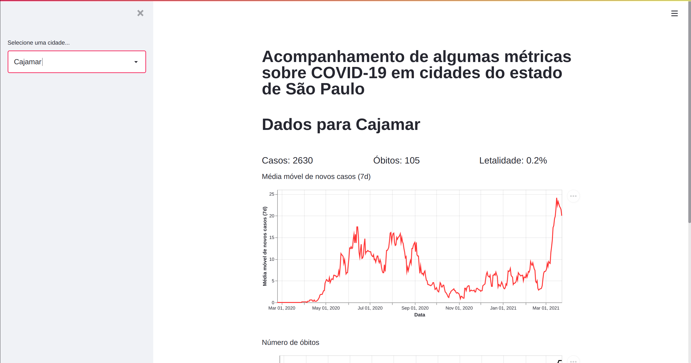

covid_cajamar
==============================

## TO DO
- [x] Adds a city filter to plot graphs for another cities
- [x] Generate better visualizations
- [x] Generate visualizations in a web app
- [x] Serve the web app visualizations in a Docker container
that runs all extractions scripts and start the app

Data gathering and visualization for covid data from São Paulo state cities.



Project Organization
------------
```
├── data
│   ├── external                  -- folder with features from other databases (if any)
│   ├── interim                   -- intermediate data (pre-processed)
│   ├── processed                 -- processed data (features to be used)
│   └── raw                       -- raw data
├── refs                          -- domain knowledge reference material
├── notebooks                     -- storage of experimental notebooks
├── setup.py                      -- setup file for the module to be installable
├── covid_cajamar                 -- folder where the scripts are stored
│   ├── app                       -- main streamlit app code
│   ├── extraction                -- scripts for data extraction
│   ├── interfaces                -- abstract classes
│   ├── pipelines                 -- data collection and processing pipelines
│   └── config.py                 -- enviroment parameters
├── tests                         -- folder with test scripts
├── scripts                       -- folder with bash scripts used for setup the project
├── README.md                     -- description of what the project consists of, how to reproduce it and how to contribute
├── Dockerfile                    -- Describes the docker image.
├── .dockerignore                 -- Describes assets to be ignore by docker.
└── pyproject.toml                -- file that specify all code dependencies
```

## How to install
To install run
```
$ scripts/bootstrap
```
After installing you could access the virtual enviroment with `poetry shell` \
Create a github repository and add the remote origin to do your project version control.

## How to run
```
$ scripts/startapp
```

## How to contribute
Install all project dependencies (prod and dev)
```
$ poetry install
```

Create your own branch, do your contribution and certifies that the code is complaint with the code standards:
```
$ poetry run fmt-check
$ poetry run isort-check
$ poetry run linter
$ poetry run tests
```
Now, open the pull request and enjoy code review :)
